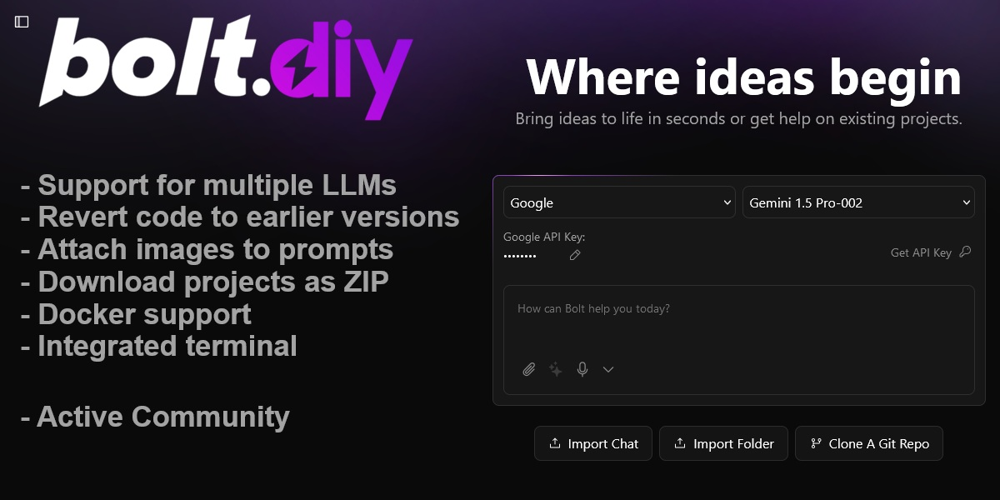

[](https://bolt.new)

# Bolt.new: AI-Powered Full-Stack Web Development in the Browser

Bolt.new 是一个 AI 驱动的 Web 开发代理，允许您直接从浏览器提示、运行、编辑和部署全栈应用程序，无需本地设置。如果您在这里使用 Bolt 开源代码库构建自己的 AI 驱动的 Web 开发代理。

本项目在原始项目的基础上，增加了OpenAI兼容接口调用，可以使用部署于本地的LLMs服务。

## 1、安装

```bash
# 安装Nodejs和pnpm
# 安装Node.js的方法参见https://nodejs.org/zh-cn
npm install pnpm -g
# 下载代码
git clone https://github.com/little51/bolt.new.local
cd bolt.new.local
# 安装依赖库
pnpm install
```

## 2、配置

LLMs服务的配置在.env文件中，以下为配置好的样例：

```bash
# LLM服务提供者
# 可选OpenAI或Anthropic
VITE_LLM_PROVIDER=OpenAI
# OpenAI参数
VITE_OPENAI_BASE_URL=https://gitclone.com/aiit/ollama/v1
VITE_OPENAI_API_KEY=EMPTY
VITE_OPENAI_MODEL_NAME=glm4
# Anthropic参数
VITE_ANTHROPIC_API_KEY=
```

## 3、运行

```shell
pnpm run dev
# 然后访问http://localhost:8501
# 打包、发布参考VITE的相关资料
```


# 以下是原始项目的说明原文

Bolt.new is an AI-powered web development agent that allows you to prompt, run, edit, and deploy full-stack applications directly from your browser—no local setup required. If you're here to build your own AI-powered web dev agent using the Bolt open source codebase, [click here to get started!](./CONTRIBUTING.md)

## What Makes Bolt.new Different

Claude, v0, etc are incredible- but you can't install packages, run backends or edit code. That’s where Bolt.new stands out:

- **Full-Stack in the Browser**: Bolt.new integrates cutting-edge AI models with an in-browser development environment powered by **StackBlitz’s WebContainers**. This allows you to:
  - Install and run npm tools and libraries (like Vite, Next.js, and more)
  - Run Node.js servers
  - Interact with third-party APIs
  - Deploy to production from chat
  - Share your work via a URL

- **AI with Environment Control**: Unlike traditional dev environments where the AI can only assist in code generation, Bolt.new gives AI models **complete control** over the entire  environment including the filesystem, node server, package manager, terminal, and browser console. This empowers AI agents to handle the entire app lifecycle—from creation to deployment.

Whether you’re an experienced developer, a PM or designer, Bolt.new allows you to build production-grade full-stack applications with ease.

For developers interested in building their own AI-powered development tools with WebContainers, check out the open-source Bolt codebase in this repo!

## Tips and Tricks

Here are some tips to get the most out of Bolt.new:

- **Be specific about your stack**: If you want to use specific frameworks or libraries (like Astro, Tailwind, ShadCN, or any other popular JavaScript framework), mention them in your initial prompt to ensure Bolt scaffolds the project accordingly.

- **Use the enhance prompt icon**: Before sending your prompt, try clicking the 'enhance' icon to have the AI model help you refine your prompt, then edit the results before submitting.

- **Scaffold the basics first, then add features**: Make sure the basic structure of your application is in place before diving into more advanced functionality. This helps Bolt understand the foundation of your project and ensure everything is wired up right before building out more advanced functionality.

- **Batch simple instructions**: Save time by combining simple instructions into one message. For example, you can ask Bolt to change the color scheme, add mobile responsiveness, and restart the dev server, all in one go saving you time and reducing API credit consumption significantly.

## FAQs

**Where do I sign up for a paid plan?**  
Bolt.new is free to get started. If you need more AI tokens or want private projects, you can purchase a paid subscription in your [Bolt.new](https://bolt.new) settings, in the lower-left hand corner of the application. 

**What happens if I hit the free usage limit?**  
Once your free daily token limit is reached, AI interactions are paused until the next day or until you upgrade your plan.

**Is Bolt in beta?**  
Yes, Bolt.new is in beta, and we are actively improving it based on feedback.

**How can I report Bolt.new issues?**  
Check out the [Issues section](https://github.com/stackblitz/bolt.new/issues) to report an issue or request a new feature. Please use the search feature to check if someone else has already submitted the same issue/request.

**What frameworks/libraries currently work on Bolt?**  
Bolt.new supports most popular JavaScript frameworks and libraries. If it runs on StackBlitz, it will run on Bolt.new as well.

**How can I add make sure my framework/project works well in bolt?**  
We are excited to work with the JavaScript ecosystem to improve functionality in Bolt. Reach out to us via [hello@stackblitz.com](mailto:hello@stackblitz.com) to discuss how we can partner!
